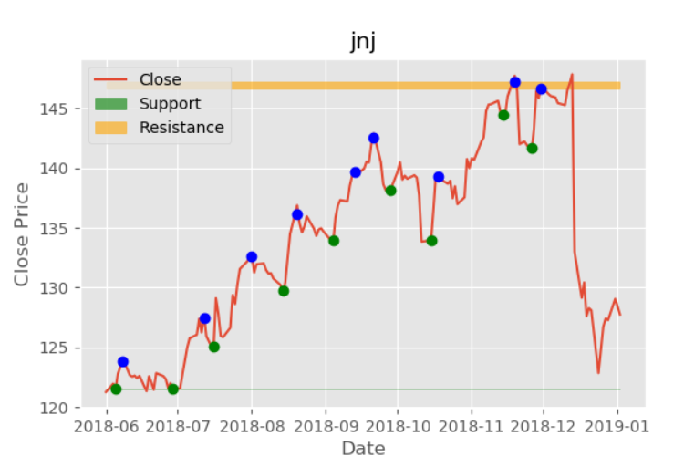
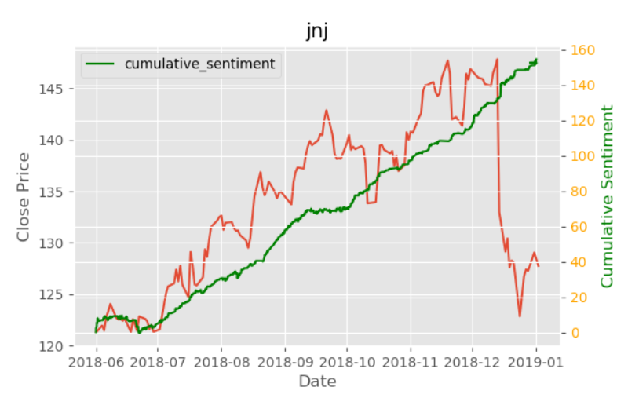
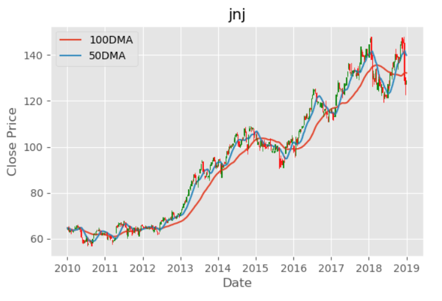
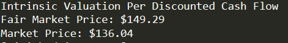

# Financial Analysis     
               
This script takes a stock ticker, performs a discounted cash flow valuation, identifies support and resistance levels alongside entry and exit points. This leads to a final sentiment vs price analysis conducted with data from twitter.
        

 
  
   

    
  

 

## Discounted Cash Flow ##

A discounted cash flow does what it implies. It estimates a companies future cash flows, and discounts these cash flows at some rate to arrive at the intrinsic value of the company and is the most widely used technique.

This DCF model is broken into these 3 parts
* Forecasting Free Cash Flows (FCF)
  

* Weighted Average Cost of Capital (WACC)
  

* Terminal and Intricsic Value
  
 
## Technical Analysis ##
Technical analysis allows us to determine patterns not usually found through financial analysis.

This portion of the program is split into determining the following
* Entry/Exit Points to Determine Support and Resistance Regios

## Sentiment Analysis ## 

I scraped tweets from twitter corresponding to a specific stock ticker and plot the sentiment and price correlation.
* Determining Sentiment

* Relating Sentiment and Price

### Dependencies/Libraries Used ###
1. Pandas
2. Numpy
3. MatPlotLib
4. GOT3
5. TextBlob
6. Requests
7. BeautifulSoup
